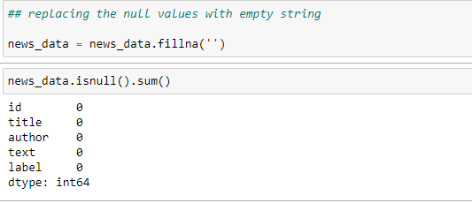
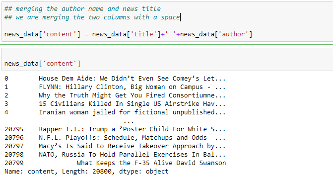
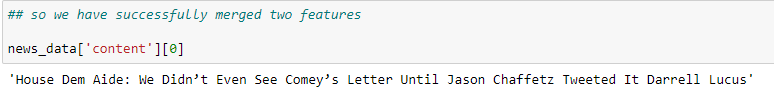
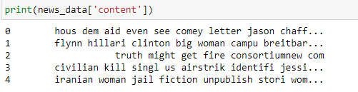
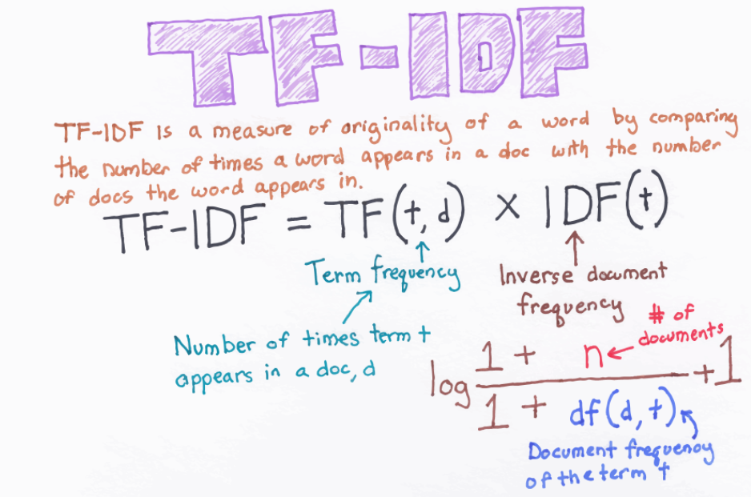
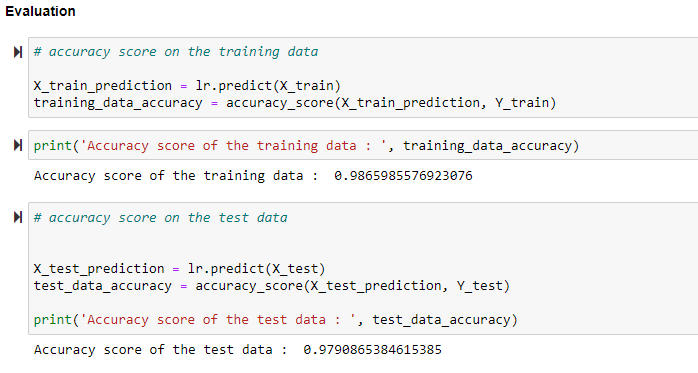
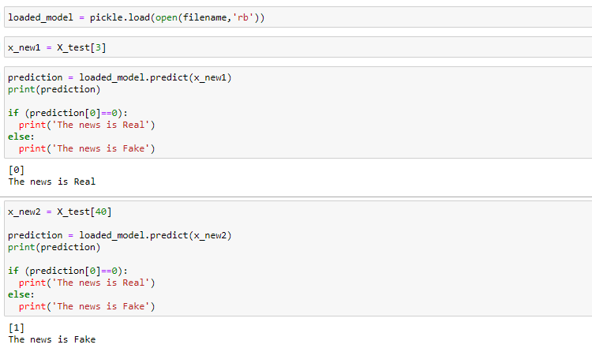

# Fake-News-Prediction

#### I collected the dataset from [here](https://www.kaggle.com/c/fake-news/data?select=train.csv).

## Problem Statement :

  This is a kind of classification problem where we need to identify unreliable news articles.
  
  The goal is to predict that a news is Fake or Real.
  
## Dataset Descriprion:

  The dataset with the following attributes:

    * id: unique id for a news article
    * title: the title of a news article
    * author: author of the news article
    * text: the text of the article; could be incomplete
    * label: a label that marks the article as potentially unreliable
                1: unreliable i.e. Fake
                0: reliable i.e. Real
                
 ## Procedure followed for this experiment:
    
### 1. Dataset loading and preprocessing of dataset:

      * Importing different libraries like numpy, pandas, sklearn etc.
      * Importing the nltk library and downloading the stopwords.
      * Verifying the null values in the dataset.
      
#### As we have the dataset with huge 20800 records , and only around 1800 records have null values.

#### So, we replacd the null values with empty string.

   

#### The records in the text column are very long so computation will take much time, so we will combine the title and author column to do the classification.

   
   
   
   
### 2. Stemming 
    * Stemming is the process of reducing a word to its Root word. example: actor, actress, acting --> act
    * For this I have used PorterStemmer of nltk library.
    * Then we created a function so that we can extract the raw words from the data using PorterStemmer which are not in English stopwords.
    
   
   
### 3. TfidfVectorizer
    * As the machine only understands the numeric things so to transform text into a meaningful representation of numbers we used TfidfVectorizer.
    
    
   
    * So these numeric values will be used during training.
    
### 4. Training 

    * For training i separated the dataset using train test split.
    * Introduced LogisticRegression model.
    * After the training I evaluated the accuracy scores based on train and test data
    
   
   
    * Then saved the model for future preprocessing.
    
### 5. Testing the model

    *  After loading the saved model, I created some test data to see the result.
   
   
   
#### Thanks for visiting!!!
   
   
 
